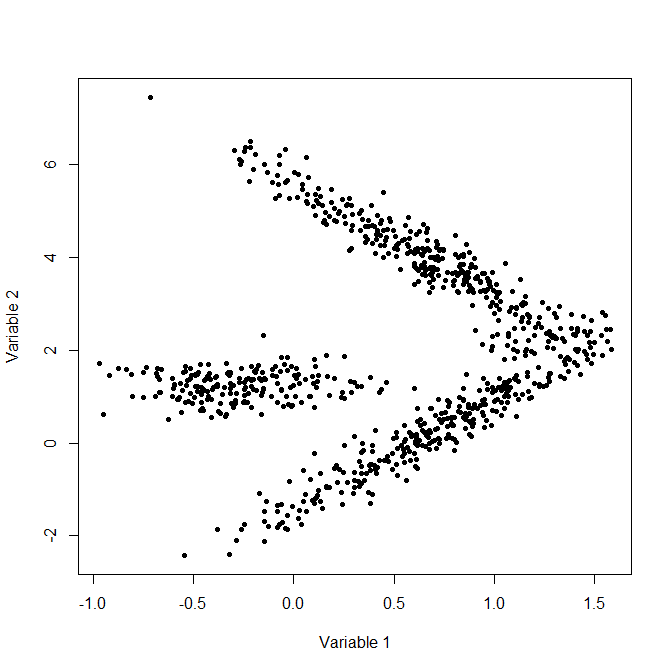

Brief description
=================


In this lab, we will perform these methods using the *Iris* flower data
set, but note that it is different from the one you used in Labs 5 and
6. The data set only contains two features, sepal length and petal
length.

Questions
=========

$K$-means clustering iterates between two procedures, given the number
of clusters $K$ and initial centres:

1.  Assign each observation to the cluster whose centre is the closest
    to it, and

2.  Update each centre to be the average of the observations in that
    cluster. The algorithm is complete when the class memberships and
    means are stabilized.


**Q1** Load the data and perform `kmeans` by completing the code below.
The `withinss` variable of `kmobj` stores the
within-cluster sum of squares from the centre, for each cluster.
What is the total within-cluster sum of squares?

::: {.solbox data-latex=""}
```{r q1-sol, warning=FALSE, message=FALSE}
library(tidyverse)
irisred <- readRDS("irisreduced.RDS")
kmobj <- kmeans( irisred, centers = 2, nstart = 50)
```
The `r kmobj$withinss`

:::

**Q2** Use a `for` loop (or other method) to obtain the total within-cluster sum
of squares for $K=1,2,\ldots,10$, keeping the argument `nstart=50`
when running `kmeans`. Plot these values against $K$. Which value of
$K$ will you choose, and why?

::: {.solbox data-latex=""}
```{r q2-sol}

# some code

```

:::


**Q3** The `nstart` argument specifies the number of initial
configurations. Why is it **not** recommended to leave it as the
default value (i.e., 1)?

::: {.solbox data-latex=""}
Some text.

:::


Now, perform model-based clustering using the `Mclust` function in
package `mclust` (R is case-sensitive).

**Q4** What is the number of clusters suggested by the best
    model, and its associated BIC value? Note: for this package, you want the *largest* BIC (packages calculate these things differently).
    
::: {.solbox data-latex=""}

```{r q4-sol, message=FALSE, warning=FALSE}
library(mclust)


```


:::
    

**Q5** Compare the clusters you obtained in **Q4** and for
$K$-means (i.e., in **Q2**) with the same value of $K$ as in **Q4**.
Are the clusters identical? **Hint**: You can either plot or compare the fitted classes
extracted from the relevant R objects. Also, there is something called "label switching": the class names (1 or 2) don't really mean anything. So you may have to make sure that the results from the two methods are comparable (you may have to "switch back" one of the labelings.)

::: {.solbox data-latex=""}
```{r q5-sol}
# some code

```

:::

**Q6** There are instances where both of the clustering
methods covered in this lab may yield poor results. Look at the 
following figure:
```{r gfx, echo = FALSE, out.width="3in", fig.align='center'}

```
Notice that there are really two clusters of data,
with one that looks like a rotated *V*. Explain how each of the
clustering methods covered in this lab will fail to appropriately
form clusters of the data.

::: {.solbox data-latex=""}
Some text.

:::
